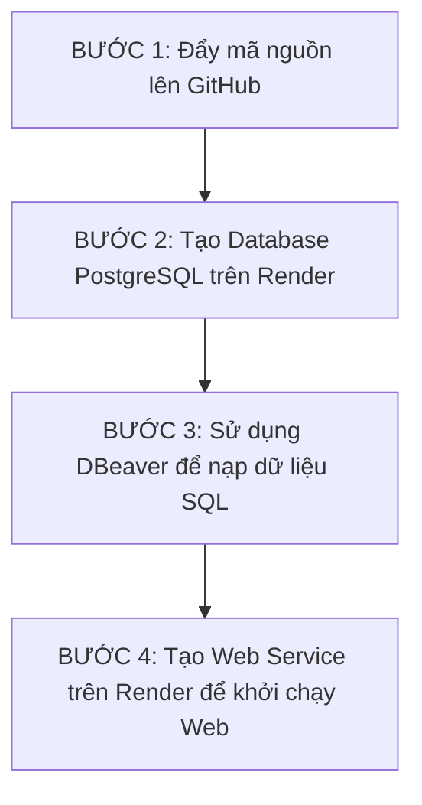

# TÀI LIỆU HƯỚNG DẪN CHUYỂN ĐỔI POSTGRESQL & DEPLOY DỰ ÁN

Tài liệu này ghi lại toàn bộ những thay đổi kỹ thuật đã được thực hiện đối với mã nguồn của dự án **Quản lý Thư viện**, đồng thời cung cấp hướng dẫn chi tiết từng bước để triển khai (deploy) ứng dụng này lên **GitHub** và **Render** hoàn toàn miễn phí.

---

## PHẦN I: CÁC THAY ĐỔI ĐÃ THỰC HIỆN TRONG CODE

Ban đầu, dự án được viết để chạy với cơ sở dữ liệu **MySQL** ở local. Khi chuyển sang deploy miễn phí trên đám mây (Render), chúng ta đã chuyển đổi toàn bộ mã nguồn sang **PostgreSQL** để sử dụng dịch vụ PostgreSQL Free của Render. 

Các file đã chỉnh sửa bao gồm:

### 1. Sửa lỗi đường dẫn API ở Frontend
* **File chỉnh sửa**: [public/app.js](file:///Users/boss/Downloads/Học%20tập/đại%20cả%20là%20học/quản_trị_cơ_sở_dữ_liệu/file%20test%20btl%202/public/app.js)
* **Chi tiết thay đổi**:
  * Đã chuyển dòng số 1 từ `const API = 'http://localhost:3000/api';` thành `const API = '/api';`.
  * **Mục đích**: Chạy bằng đường dẫn tương đối (relative path). Khi chạy trên local hay trên Render, trình duyệt sẽ tự động gọi API cùng với tên miền (domain) hiện tại của web, tránh việc gọi về `localhost:3000` gây lỗi kết nối ở phía Client.

### 2. Thay đổi thư viện kết nối Database ở Backend
* **File chỉnh sửa**: [package.json](file:///Users/boss/Downloads/Học%20tập/đại%20cả%20là%20học/quản_trị_cơ_sở_dữ_liệu/file%20test%20btl%202/package.json)
* **Chi tiết thay đổi**:
  * Gỡ bỏ dependency `mysql2`.
  * Thêm dependency `"pg": "^8.11.0"` (Thư viện PostgreSQL chính thức dành cho Node.js).

### 3. Xử lý logic kết nối tương thích ngược ở Server (Cực kỳ quan trọng)
* **File chỉnh sửa**: [server.js](file:///Users/boss/Downloads/Học%20tập/đại%20cả%20là%20học/quản_trị_cơ_sở_dữ_liệu/file%20test%20btl%202/server.js)
* **Chi tiết thay đổi**:
  * Thay vì phải viết lại hàng chục API lấy dữ liệu hiện tại, chúng ta đã triển khai một **lớp tương thích ngược (Compatibility Wrapper)** cho PostgreSQL.
  * **Hàm `translateQuery(sql, params)`**: Tự động phát hiện và dịch các cú pháp SQL đặc thù của MySQL sang PostgreSQL khi có truy vấn:
    * Đổi các placeholder dạng `?` sang dạng `$1, $2...` của PostgreSQL.
    * Dịch hàm ghép chuỗi: `GROUP_CONCAT` -> `STRING_AGG`.
    * Dịch định dạng ngày tháng: `DATE_FORMAT` -> `TO_CHAR`.
    * Dịch hàm lấy ngày hiện tại: `CURDATE()` -> `CURRENT_DATE`.
    * Dịch hàm so sánh khoảng cách ngày: `DATEDIFF(A, B)` -> `(A - B)`.
    * Loại bỏ ký tự Unicode prefix đặc thù của MySQL: `N'Đang mượn'` -> `'Đang mượn'`.
    * Tự động điều chỉnh các mệnh đề `GROUP BY` để đáp ứng tiêu chuẩn nghiêm ngặt (strict mode) của PostgreSQL.
  * **Hàm `normalizeRow(row)`**: Vì PostgreSQL mặc định chuyển tất cả tên cột kết quả về dạng chữ thường (lowercase) khiến frontend không đọc được (frontend đang đọc kiểu camelCase/PascalCase như `MaNV`, `TenTL`), hàm này tự động đối chiếu và đổi lại tên cột về đúng định dạng gốc.
  * **Transaction Wrapper**: Tạo wrapper giả lập phương thức `beginTransaction()`, `commit()`, `rollback()` giống như thư viện MySQL cũ để API tạo phiếu mượn/trả sách hoạt động ổn định.

### 4. Tạo file SQL tương thích PostgreSQL
* **File tạo mới**: [database_postgres.sql](file:///Users/boss/Downloads/Học%20tập/đại%20cả%20là%20học/quản_trị_cơ_sở_dữ_liệu/file%20test%20btl%202/database_postgres.sql)
* **Chi tiết thay đổi**:
  * Loại bỏ các cú pháp đặc thù MySQL như `ENGINE=InnoDB CHARACTER SET utf8mb4...` và lệnh `USE`.
  * Sắp xếp lại thứ tự tạo/xóa bảng có ràng buộc khóa ngoại (Foreign Key) để đảm bảo không bị lỗi xung đột ràng buộc khi import dữ liệu.

### 5. Cấu hình biến môi trường
* **File chỉnh sửa**: [.env](file:///Users/boss/Downloads/Học%20tập/đại%20cả%20là%20học/quản_trị_cơ_sở_dữ_liệu/file%20test%20btl%202/.env)
* **Chi tiết thay đổi**: Cập nhật lại hướng dẫn cấu hình biến môi trường cho PostgreSQL để lập trình viên có thể test local nếu cần.

---

## PHẦN II: HƯỚNG DẪN TỪNG BƯỚC ĐỂ DEPLOY DỰ ÁN LÊN ĐÁM MÂY

Quy trình deploy gồm 4 bước chính:



### BƯỚC 1: Đẩy mã nguồn lên GitHub
1. Mở Terminal ngay tại thư mục chứa dự án.
2. Dự án đã được cấu hình Git và commit sẵn ở local, bạn chỉ cần chạy lệnh sau để đẩy code lên GitHub của bạn:
   ```bash
   git push -u origin main
   ```
   *(Mã nguồn sẽ được đẩy lên link repo: `https://github.com/anhtung16062006-beep/BTL_QTCSDL-`)*
   *(Lưu ý: File `.env` chứa mật khẩu và API Key nhạy cảm đã bị `.gitignore` chặn nên hoàn toàn bảo mật)*

### BƯỚC 2: Tạo Database PostgreSQL trên Render
1. Đăng nhập vào [Render Dashboard](https://dashboard.render.com/).
2. Chọn **New** -> **PostgreSQL**.
3. Điền cấu hình:
   * **Name**: `quanlythuvien-db`
   * **Region**: Chọn **Singapore** (hoặc Oregon).
   * **Instance Type**: Chọn gói **Free** (Miễn phí).
4. Click **Create Database**.
5. Chờ khoảng 1-2 phút cho đến khi trạng thái chuyển sang màu xanh lá cây (**Available**).
6. Cuộn xuống phần **Connection Info** và copy lại 2 giá trị:
   * **External Database URL**: (Dùng cho DBeaver tại máy của bạn).
   * **Internal Database URL**: (Dùng cho Web Service của Render ở Bước 4).

### BƯỚC 3: Dùng DBeaver nạp dữ liệu vào Database
1. Mở ứng dụng **DBeaver** trên máy tính của bạn.
2. Click biểu tượng **New Connection** (Hình phích cắm điện màu xanh có dấu cộng).
3. Chọn **PostgreSQL** -> ấn **Next**.
4. Cách điền thông tin (Chọn 1 trong 2 cách):
   * **Cách A (Dùng URL)**: 
     Chuyển Connection Type sang **URL** và dán link **External Database URL** vào ô *JDBC URL*. Bạn **bắt buộc** phải thêm tiền tố `jdbc:` vào trước đường link đó.
     *Ví dụ:* `jdbc:postgresql://quanlythuvien_db_1mi2_user:pKAAP...`
   * **Cách B (Điền thủ công)**:
     Ở tab *Host* mặc định, điền các thông tin tách rời lấy từ Render:
     * **Host**: `dpg-d8dsel0js32c73fs77m0-a.singapore-postgres.render.com`
     * **Database**: `quanlythuvien_db_1mi2`
     * **Username**: `quanlythuvien_db_1mi2_user`
     * **Password**: `pKAAPzM7F82b8oCChPXJbX589hrngEg0`
5. Ấn nút **Test Connection** để kiểm tra (tải thêm driver nếu phần mềm yêu cầu) -> Nhấn **Finish**.
6. Click chuột phải vào kết nối PostgreSQL vừa tạo -> Chọn **SQL Editor** -> **New SQL script**.
7. Copy toàn bộ nội dung của file [database_postgres.sql](file:///Users/boss/Downloads/Học tập/đại cả là học/quản_trị_cơ_sở_dữ_liệu/file test btl 2/database_postgres.sql) và dán vào cửa sổ DBeaver.
8. Ấn tổ hợp phím **Alt + X** để thực thi toàn bộ script tạo bảng và nạp dữ liệu mẫu.

### BƯỚC 4: Tạo Web Service chạy dự án trên Render
1. Trên Render Dashboard, click **New** -> **Web Service**.
2. Chọn kết nối với repository GitHub của bạn: `BTL_QTCSDL-`.
3. Nhập cấu hình:
   * **Name**: `quanlythuvien-web`
   * **Region**: **Singapore** (Trùng với Database).
   * **Branch**: `main`
   * **Runtime**: `Node`
   * **Build Command**: `npm install`
   * **Start Command**: `npm start`
   * **Instance Type**: Chọn gói **Free** (Miễn phí).
4. Thiết lập biến môi trường (Environment Variables):
   Click vào mục **Add Environment Variable** để thêm 2 biến sau:
   1. **Key**: `DATABASE_URL` | **Value**: *(Dán đường dẫn **Internal Database URL** lấy ở Bước 2)*.
   2. **Key**: `GROQ_API_KEY` | **Value**: `<Dán GROQ_API_KEY của bạn vào đây>` *(Key chạy chatbot AI - lấy từ biến môi trường trong Render Dashboard)*.
5. Click **Create Web Service** ở dưới cùng.
6. Chờ Render tiến hành build và khởi động. Khi xuất hiện log màu xanh báo `Your service is live`, bạn có thể truy cập trang web qua đường dẫn URL Render cung cấp ở trên cùng bên trái giao diện.

---

> [!NOTE]
> Gói miễn phí (Free Tier) của Render có cơ chế tự động tạm ngủ (Sleep) nếu không có lượt truy cập nào trong 15 phút. Lần đầu tiên truy cập lại sau khi ngủ sẽ mất khoảng 50 giây để server khởi động lại. Các lượt truy cập tiếp theo sẽ tải rất nhanh.
